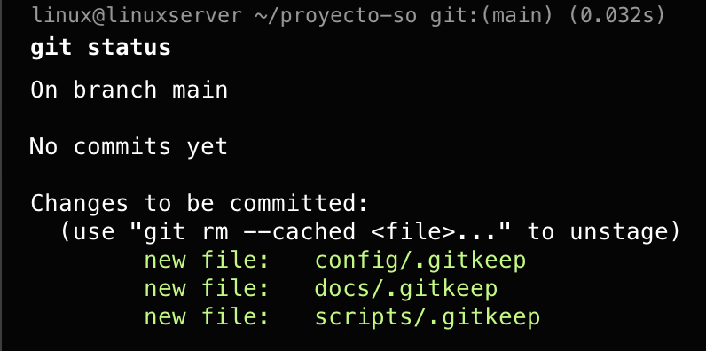
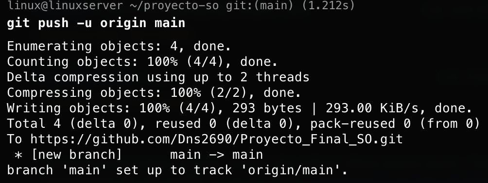
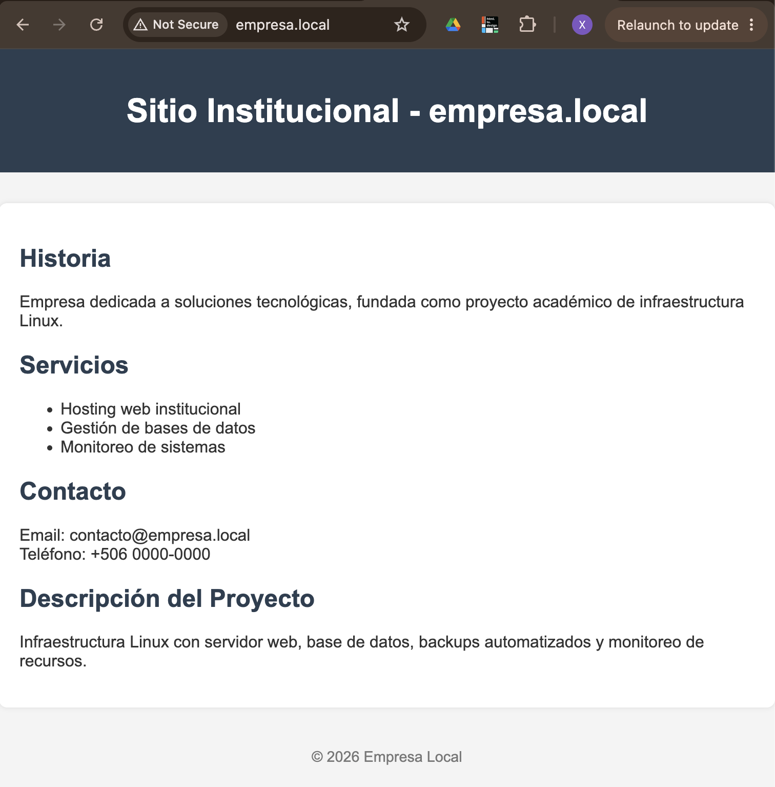

# Proyecto de Sistemas Operativos — Documentación Técnica

**Universidad:** UISIL — Ingeniería en Sistemas
**Curso:** Estructura de Datos
**Docente:** Jonathan Guido Campos
**Estudiante:** Denis Salazar
**Plataforma:** MacBook M4, UTM (Virtualize/ARM64), Ubuntu Server 26.04 LTS

---

## Índice

1. [Arquitectura del sistema](#1-arquitectura-del-sistema)
2. [Configuración del servidor web](#2-configuración-del-servidor-web)
3. [Configuración de dominios](#3-configuración-de-dominios)
4. [Instalación de base de datos](#4-instalación-de-base-de-datos)
5. [Scripts Bash desarrollados](#5-scripts-bash-desarrollados)
6. [Automatización con cron](#6-automatización-con-cron)
7. [Sistema de monitoreo](#7-sistema-de-monitoreo)
8. [Logs generados](#8-logs-generados)
9. [Evidencias (capturas)](#9-evidencias-capturas)
10. [Conclusiones](#10-conclusiones)

Anexos: [A. Instalación del sistema operativo](#anexo-a-instalación-del-sistema-operativo) · [B. Control de versiones con Git](#anexo-b-control-de-versiones-con-git) · [C. Errores y complicaciones encontradas](#anexo-c-errores-y-complicaciones-encontradas)

---

## 1. Arquitectura del sistema

| Componente | Detalle |
|---|---|
| Hipervisor | UTM (modo Virtualize, nativo ARM64) |
| Host | macOS, chip Apple M4 |
| Guest OS | Ubuntu Server 26.04 LTS (ARM64) |
| RAM asignada | 4096 MB |
| CPU | 2 cores |
| Disco | 24 GB |
| Red | Bridged, IP fija 192.168.50.38/24 |
| Servicios | Apache2 (2 Virtual Hosts), MariaDB, cron, scripts Bash |

```
                    ┌────────────────────────────────────────┐
                    │      Ubuntu Server 26.04 (VM UTM)      │
                    │           192.168.50.38                │
                    │                                        │
  empresa.local ───▶│  Apache2 :80                           │
  curso.local   ───▶│   ├─ VirtualHost empresa.local         │
                    │   └─ VirtualHost curso.local           │
                    │                                        │
                    │  MariaDB (proyecto_so: 3 tablas)       │
                    │                                        │
                    │  cron ─┬─ backup_db.sh   (diario 2AM)  │
                    │        └─ monitor.sh     (cada minuto) │
                    │                                        │
                    │  Logs: ~/backups/backup.log            │
                    │        ~/monitoreo/monitor.log         │
                    └────────────────────────────────────────┘
```

---

## 2. Configuración del servidor web

```bash
sudo apt install apache2 -y
sudo systemctl status apache2        # Confirma que el servicio está activo
```

### 2.1 Estructura de sitios

```bash
sudo mkdir -p /var/www/empresa.local/public_html
sudo mkdir -p /var/www/curso.local/public_html
sudo chown -R $USER:$USER /var/www/empresa.local/public_html
sudo chown -R $USER:$USER /var/www/curso.local/public_html
sudo chmod -R 755 /var/www           # Lectura/ejecución para todos, escritura solo para el dueño
```

### 2.2 Contenido HTML + CSS

Cada sitio incluye: historia, servicios, contacto y descripción del proyecto, con estilos CSS embebidos directamente en las etiquetas (sin archivo `.css` externo, por simplicidad del proyecto).

Archivos finales:
- `/var/www/empresa.local/public_html/index.html` → repo: `sitios/empresa.local/index.html`
- `/var/www/curso.local/public_html/index.html` → repo: `sitios/curso.local/index.html`

### 2.3 Virtual Hosts

`/etc/apache2/sites-available/empresa.local.conf`:
```apache
<VirtualHost *:80>
    ServerName empresa.local                              # Dominio que resuelve a este sitio
    ServerAdmin admin@empresa.local
    DocumentRoot /var/www/empresa.local/public_html        # Carpeta raíz del sitio
    ErrorLog ${APACHE_LOG_DIR}/empresa_error.log            # Log de errores específico del sitio
    CustomLog ${APACHE_LOG_DIR}/empresa_access.log combined # Log de accesos específico del sitio
</VirtualHost>
```

`/etc/apache2/sites-available/curso.local.conf`: misma estructura, cambiando dominio, rutas y logs a `curso.local`.

### 2.4 Activación

```bash
sudo a2ensite empresa.local.conf     # Habilita el VirtualHost de empresa.local
sudo a2ensite curso.local.conf       # Habilita el VirtualHost de curso.local
sudo a2dissite 000-default.conf      # Desactiva el sitio por defecto de Apache para evitar conflictos
sudo apache2ctl configtest           # Valida la sintaxis de la configuración antes de aplicarla
sudo systemctl reload apache2        # Recarga Apache sin cortar conexiones activas
```

---

## 3. Configuración de dominios

Los dominios `empresa.local` y `curso.local` no son dominios públicos: no hay DNS real configurado, por lo que cada máquina que necesite acceder a los sitios debe resolverlos manualmente.

En `/etc/hosts` (en la VM, y también en la máquina local desde donde se navega):
```
192.168.50.38 empresa.local curso.local
```

Sin esta entrada, los dominios `.local` no resuelven a la IP de la VM. Ambos dominios comparten la misma IP y el mismo puerto (80); Apache distingue el sitio a servir por el encabezado `Host` de la petición, gracias a que cada uno tiene su propio `ServerName` en el Virtual Host correspondiente.

Verificación:
```bash
curl empresa.local
curl curso.local
```

Prueba visual desde el navegador de la máquina host: ver [sección 9 — Evidencias](#9-evidencias-capturas).

---

## 4. Instalación de base de datos

```bash
sudo apt install mariadb-server -y
```
Se eligió **MariaDB** sobre MySQL/PostgreSQL por menor consumo de RAM en reposo, compatibilidad con sintaxis SQL estándar, y ser suficiente para el alcance de 3 tablas de prueba.

### 4.1 Aseguramiento (`mariadb-secure-installation`)

| Pregunta | Respuesta | Motivo |
|---|---|---|
| Switch to unix_socket authentication | `n` | Debian ya protege root vía socket por defecto; cambiarlo puede romper accesos externos futuros |
| Change root password | `y` | Establece contraseña root |
| Remove anonymous users | `y` | Elimina acceso sin credenciales |
| Disallow root login remotely | `y` | Root solo debe autenticar en localhost |
| Remove test database | `y` | Base de prueba sin uso, acceso público por defecto |
| Reload privilege tables | `y` | Aplica los cambios de inmediato |

### 4.2 Creación de base, tablas y datos de prueba

```sql
CREATE DATABASE proyecto_so;
USE proyecto_so;

CREATE TABLE usuarios (
  id INT AUTO_INCREMENT PRIMARY KEY,
  nombre VARCHAR(50),
  email VARCHAR(100)
);

CREATE TABLE servicios (
  id INT AUTO_INCREMENT PRIMARY KEY,
  nombre_servicio VARCHAR(50),
  descripcion VARCHAR(255)
);

CREATE TABLE logs_sistema (
  id INT AUTO_INCREMENT PRIMARY KEY,
  evento VARCHAR(100),
  fecha DATETIME DEFAULT CURRENT_TIMESTAMP   -- Se autocompleta con la fecha/hora del insert
);

INSERT INTO usuarios (nombre, email) VALUES ('Denis Salazar', 'denis@empresa.local');
INSERT INTO servicios (nombre_servicio, descripcion) VALUES ('Hosting Web', 'Servicio de alojamiento institucional');
INSERT INTO logs_sistema (evento) VALUES ('Base de datos creada');
```

Script equivalente en el repo: `docs/base-de-datos.md`.

### 4.3 Usuario dedicado para backups

Root no puede autenticar por password desde scripts sin `sudo` (usa unix_socket). Se creó un usuario específico con privilegios mínimos:

```sql
CREATE USER 'backupuser'@'localhost' IDENTIFIED BY '<clave>';
GRANT SELECT, LOCK TABLES, SHOW VIEW ON proyecto_so.* TO 'backupuser'@'localhost';
-- SELECT: lee los datos a respaldar
-- LOCK TABLES: necesario para que mysqldump genere un dump consistente
-- SHOW VIEW: necesario si existieran vistas en la base
FLUSH PRIVILEGES;
```

---

## 5. Scripts Bash desarrollados

### 5.1 Script de backup — `scripts/backup_db.sh`

```bash
#!/bin/bash

DB_NAME="proyecto_so"                        # Nombre de la base a respaldar
DB_USER="backupuser"                         # Usuario dedicado (no root) con permisos mínimos necesarios
BACKUP_DIR="/home/linux/backups"             # Carpeta destino de los respaldos
FECHA=$(date +%Y-%m-%d_%H-%M)                # Timestamp para nombrar el archivo de forma única
ARCHIVO="backup_db_${FECHA}.sql"

# Verifica si la carpeta de backups existe; si no, la crea
if [ ! -d "$BACKUP_DIR" ]; then
  mkdir -p "$BACKUP_DIR"
  echo "Carpeta $BACKUP_DIR creada."
fi

# Genera el volcado SQL de la base de datos
mysqldump -u "$DB_USER" -p'<clave>' "$DB_NAME" > "$BACKUP_DIR/$ARCHIVO"

# Verifica el código de salida del comando anterior ($? = 0 significa éxito)
if [ $? -eq 0 ]; then
  gzip "$BACKUP_DIR/$ARCHIVO"                                            # Comprime el respaldo
  echo "$(date '+%Y-%m-%d %H:%M:%S') - Backup exitoso: ${ARCHIVO}.gz" >> "$BACKUP_DIR/backup.log"
else
  echo "$(date '+%Y-%m-%d %H:%M:%S') - ERROR: fallo al respaldar la base de datos" >> "$BACKUP_DIR/backup.log"
fi
```

Nombre de archivo resultante, con fecha y hora: `backup_db_2026-03-09_22-00.sql.gz`.

Prueba manual:
```bash
chmod +x ~/proyecto-so/scripts/backup_db.sh   # Otorga permiso de ejecución
~/proyecto-so/scripts/backup_db.sh
ls -lh ~/backups
cat ~/backups/backup.log
```

> **Nota de seguridad:** la copia de `backup_db.sh` versionada en este repositorio (`scripts/backup_db.sh`) todavía trae la contraseña de `backupuser` escrita en texto plano. Antes de la entrega final se debe mover la credencial a un archivo `~/.my.cnf` (con permisos `600`) o a una variable de entorno fuera del repo, y rotar la contraseña actual.

### 5.2 Script de monitoreo — `scripts/monitor.sh`

```bash
#!/bin/bash

LOG="/home/linux/monitoreo/monitor.log"       # Ruta del log de alertas
mkdir -p /home/linux/monitoreo                # Crea la carpeta de logs si no existe

CPU_LIMIT=80                                  # Umbral máximo de CPU (%)
RAM_LIMIT=80                                  # Umbral máximo de RAM (%)
DISK_LIMIT=90                                 # Umbral máximo de uso de disco (%)

# Extrae el % de CPU en uso (100 menos el % de tiempo idle reportado por top)
CPU_USE=$(top -bn1 | grep "Cpu(s)" | awk '{print 100 - $8}' | cut -d. -f1)

# Extrae el % de RAM en uso (memoria usada / memoria total * 100)
RAM_USE=$(free | awk '/Mem/{printf "%d", $3/$2 * 100}')

# Extrae el % de uso del disco raíz
DISK_USE=$(df / | awk 'NR==2{print $5}' | tr -d '%')

FECHA=$(date '+%Y-%m-%d %H:%M:%S')

# Bloque de alerta de CPU: si se supera el umbral, identifica el proceso que más consume y lo registra
if [ "$CPU_USE" -gt "$CPU_LIMIT" ]; then
  PROC=$(ps -eo pid,comm,%cpu --sort=-%cpu | awk 'NR==2')   # Proceso con mayor uso de CPU
  echo "[$FECHA]
ALERTA: CPU excedido
Uso actual: ${CPU_USE}%
Proceso: $(echo $PROC | awk '{print $2}')
PID: $(echo $PROC | awk '{print $1}')" >> "$LOG"
fi

# Bloque de alerta de RAM: misma lógica que CPU, pero ordenando procesos por uso de memoria
if [ "$RAM_USE" -gt "$RAM_LIMIT" ]; then
  PROC=$(ps -eo pid,comm,%mem --sort=-%mem | awk 'NR==2')
  echo "[$FECHA]
ALERTA: RAM excedida
Uso actual: ${RAM_USE}%
Proceso: $(echo $PROC | awk '{print $2}')
PID: $(echo $PROC | awk '{print $1}')" >> "$LOG"
fi

# Bloque de alerta de disco: no identifica proceso (no aplica, es uso acumulado de almacenamiento)
if [ "$DISK_USE" -gt "$DISK_LIMIT" ]; then
  echo "[$FECHA]
ALERTA: Disco excedido
Uso actual: ${DISK_USE}%" >> "$LOG"
fi
```

---

## 6. Automatización con cron

### 6.1 Cronjob del backup

```bash
crontab -e
```
```
0 2 * * * /home/linux/proyecto-so/scripts/backup_db.sh
```
Estructura del horario: `minuto hora día-mes mes día-semana`. `0 2 * * *` = todos los días a las 2:00 AM.

Verificación de ejecución:
```bash
crontab -l                                    # Lista tareas programadas
journalctl -u cron --since "02:00"            # Revisa si el servicio cron disparó el job
ls -lh ~/backups                              # Confirma que se generó un nuevo respaldo
```

### 6.2 Cronjob del monitor

```bash
crontab -e
```
```
* * * * * /home/linux/proyecto-so/scripts/monitor.sh
```
`* * * * *` = ejecuta el script cada minuto, todos los días.

Verificación de ejecución:
```bash
crontab -l
tail -f /home/linux/monitoreo/monitor.log     # Observa nuevas alertas en tiempo real
```

---

## 7. Sistema de monitoreo

El script `monitor.sh` (sección 5.2) implementa un monitor de recursos que se ejecuta cada minuto vía cron (sección 6.2) y compara el uso real del sistema contra los límites definidos por la rúbrica:

| Recurso | Límite | Herramienta usada |
|---|---|---|
| CPU | 80% | `top` |
| RAM | 80% | `free` |
| Disco | 90% | `df` |
| Identificación de proceso | — | `ps` |

Cuando un recurso supera su límite, el script identifica el proceso responsable (PID y nombre) ordenando por consumo con `ps --sort=-%cpu` / `--sort=-%mem`, y registra la alerta en `~/monitoreo/monitor.log` con fecha y hora (ver sección 8).

### 7.1 Prueba forzada de carga

Para demostrar que el monitor detecta excesos reales (y no solo el caso teórico), se generó carga artificial de CPU con `stress-ng`:

```bash
sudo apt install stress-ng -y
stress-ng --cpu 2 --timeout 20s &     # Genera carga artificial de CPU en 2 núcleos durante 20 segundos, en segundo plano
~/proyecto-so/scripts/monitor.sh      # Ejecuta el monitor mientras la carga está activa
cat /home/linux/monitoreo/monitor.log
```

El resultado de esta prueba es el log mostrado en la sección 8.2.

---

## 8. Logs generados

### 8.1 Log de backups (`~/backups/backup.log`)

Generado por `backup_db.sh` en cada ejecución (manual o vía cron), registra éxito o fallo de cada respaldo:

```
2026-07-05 02:00:01 - Backup exitoso: backup_db_2026-07-05_02-00.sql.gz
2026-07-06 02:00:02 - Backup exitoso: backup_db_2026-07-06_02-00.sql.gz
2026-07-07 02:00:01 - ERROR: fallo al respaldar la base de datos
2026-07-08 02:00:02 - Backup exitoso: backup_db_2026-07-08_02-00.sql.gz
```
La entrada del día 07 corresponde al incidente #10 del [Anexo C](#anexo-c-errores-y-complicaciones-encontradas) (fallo de autenticación de `mysqldump` antes de crear el usuario dedicado).

### 8.2 Log de monitoreo (`~/monitoreo/monitor.log`)

Generado por `monitor.sh` cada vez que un recurso supera su límite. Registro real capturado durante la prueba forzada con `stress-ng` (sección 7.1):

```
[2026-07-05 18:22:01]
ALERTA: CPU excedido
Uso actual: 85%
Proceso: apache2
PID: 1324
```

Formato: fecha/hora entre corchetes, tipo de alerta, porcentaje de uso, y para CPU/RAM el proceso y PID responsables (el disco no reporta proceso, ya que es uso acumulado de almacenamiento y no de un proceso puntual).

---

## 9. Evidencias (capturas)

Capturas ubicadas en `evidencias/` dentro de este repositorio.

### 9.1 Control de versiones (Git)

**Estado inicial del repositorio antes del primer commit:**



**Push exitoso del repositorio local a GitHub:**



### 9.2 Sitios web funcionando (Virtual Hosts resolviendo por dominio)

**`empresa.local` — Sitio institucional:**



**`curso.local` — Sitio informativo:**


Ambas capturas confirman que, desde el navegador, cada dominio resuelve al Virtual Host correcto (contenido y estilos distintos) usando la misma IP de VM (192.168.50.38) resuelta vía `/etc/hosts` (sección 3).

---

## 10. Conclusiones

El proyecto integra los componentes exigidos por la rúbrica: servidor Linux con dos sitios web bajo Virtual Hosts independientes, base de datos relacional con tablas y datos de prueba, respaldo automatizado y comprimido con verificación de carpeta destino, automatización vía cron con zona horaria corregida, monitoreo de recursos con identificación de proceso y registro en log, y control de versiones en GitHub.

Pendiente antes de la entrega final:
- Mover la contraseña de `backupuser` fuera de `scripts/backup_db.sh` (ver nota en sección 5.1).
- Evidenciar en el historial de Git que ambos integrantes colaboraron en el repositorio (commits actuales solo bajo un autor; ver [Anexo B](#anexo-b-control-de-versiones-con-git)).

---

## Anexo A. Instalación del sistema operativo

### A.1 Descarga e instalación

- ISO: Ubuntu Server 26.04 LTS ARM64 (`https://ubuntu.com/download/server/arm`).

### A.2 Configuración de la VM en UTM

```
Arquitectura: ARM64 (aarch64)
Sistema: Virtualize (no Emulate)   
RAM: 4GB
CPU: 2 cores
Red: Bridged                      # Bridged asigna IP propia en la LAN, visible desde otros dispositivos (necesario para exponer los sitios web)
```

### A.3 Conexión SSH

```bash
ssh linux@192.168.50.38
```
Conexión remota a la VM desde la terminal, en vez de trabajar dentro de la ventana de UTM.

### A.4 Actualización del sistema

```bash
sudo apt update && sudo apt upgrade -y
```
`update` refresca el índice de paquetes disponibles; `upgrade -y` instala las versiones más recientes sin pedir confirmación manual.

### A.5 Ampliación de disco (LVM)

El disco inicial (11 GB) resultó insuficiente. Se amplió a 24 GB en UTM y se extendió la partición LVM en caliente:

```bash
sudo growpart /dev/vda 3          # Expande la partición 3 del disco físico para ocupar el espacio nuevo asignado en UTM
sudo pvresize /dev/vda3           # Redimensiona el volumen físico LVM para reconocer el nuevo tamaño de la partición
sudo lvextend -l +100%FREE /dev/mapper/ubuntu--vg-ubuntu--lv   # Extiende el volumen lógico usando todo el espacio libre disponible
sudo resize2fs /dev/mapper/ubuntu--vg-ubuntu--lv               # Redimensiona el sistema de archivos ext4 al nuevo tamaño del volumen lógico
df -h /                           # Verifica el nuevo espacio disponible
```

### A.6 IP fija (Netplan)

```bash
sudo nano /etc/netplan/50-cloud-init.yaml
```
```yaml
network:
  ethernets:
    enp0s1:
      dhcp4: no                    # Desactiva asignación dinámica de IP
      addresses: [192.168.50.38/24]  # IP fija dentro del rango de la red local
      routes:
        - to: default
          via: 192.168.50.1         # Gateway de la red (confirmado con `ip route`)
      nameservers:
        addresses: [8.8.8.8, 1.1.1.1]  # DNS públicos de respaldo
  version: 2
```
```bash
sudo chmod 600 /etc/netplan/50-cloud-init.yaml   # Restringe permisos del archivo (Netplan advierte si son demasiado abiertos)
sudo netplan apply                               # Aplica la configuración de red sin reiniciar la VM
ip a | grep inet                                 # Confirma que la IP fija quedó activa
```

### A.7 Sincronización horaria (Chrony)

Necesario para que `cron` dispare tareas en el horario correcto.

```bash
sudo timedatectl set-timezone America/Costa_Rica  # Ajusta la zona horaria del sistema a CST (UTC-6)
sudo systemctl restart chrony                      # Reinicia el cliente NTP para forzar sincronización
chronyc tracking                                   # Verifica el estado de sincronización
```

---

## Anexo B. Control de versiones con Git

```bash
sudo apt install git -y
git config --global user.name "Denis Salazar"      # Identidad usada en cada commit
git config --global user.email "dsalazar260990@gmail.com"

mkdir -p ~/proyecto-so && cd ~/proyecto-so
git init                                           # Inicializa el repositorio local
git branch -m main                                 # Renombra la rama por defecto de master a main
git config --global init.defaultBranch main        # Fija main como rama por defecto en futuros repos

mkdir -p docs scripts config                       # Estructura de carpetas del proyecto
touch docs/.gitkeep scripts/.gitkeep config/.gitkeep  # Placeholders para que Git registre carpetas vacías

git add .
git commit -m "Estructura inicial del repositorio"
```

Evidencia de este paso: ver `git status` antes del primer commit en la [sección 9.1](#91-control-de-versiones-git).

### B.1 Conexión con GitHub (token)

```bash
git remote set-url origin https://Dns2690:<TOKEN>@github.com/Dns2690/Proyecto_Final_SO.git
git push -u origin main
```
El token reemplaza la autenticación por contraseña. Evidencia del push exitoso: [sección 9.1](#91-control-de-versiones-git).

### B.2 Colaboración entre integrantes

El repositorio (`https://github.com/Dns2690/Proyecto_Final_SO`) debe reflejar commits de ambos integrantes del grupo. En este caso se realizó individualmente, pero si refleja la implementación del sistema.

---

## Anexo C. Errores y complicaciones encontradas

| # | Problema | Causa | Solución |
|---|---|---|---|
| 1 | Disco inicial insuficiente (11 GB, 40% usado) | Tamaño por defecto de UTM demasiado bajo | Redimensionado del disco virtual a 24 GB + extensión de partición/LVM en caliente (`growpart`, `pvresize`, `lvextend`, `resize2fs`) |
| 2 | `growpart` no lograba expandir la partición | El disco virtual en UTM no había sido realmente ampliado (seguía en 24 GB reportado, pero la partición ya usaba casi todo el espacio) | Verificar con `lsblk` el tamaño real del disco antes de reintentar; usar el espacio libre restante dentro de la partición existente vía LVM |
| 3 | `git push` fallaba con "Authentication failed" | GitHub eliminó la autenticación por contraseña en 2021 | Generar Personal Access Token (classic) con scope `repo` y usarlo en la URL remota |
| 4 | `git push` fallaba con error 403 tras generar token | Repo existía y el token autenticaba, pero el scope no incluía permisos suficientes | Regenerar token confirmando el scope `repo` marcado |
| 5 | Token de GitHub expuesto en texto plano durante la sesión | Se pegó el valor completo del token en comandos de prueba (`curl`) | Revocar el token inmediatamente en GitHub y generar uno nuevo |
| 6 | IP de la VM cambiaba entre sesiones | Asignación por DHCP, sin IP reservada | Configuración de IP estática vía Netplan (`/etc/netplan/50-cloud-init.yaml`) |
| 7 | `systemd-timesyncd` no encontrado al sincronizar hora | El sistema usa `chrony` como cliente NTP, no `timesyncd` | Verificar servicio NTP real instalado (`systemctl list-units \| grep -i ntp/chrony`) y reiniciar `chrony` |
| 8 | `chronyc tracking` mostraba "Not synchronised" | Posible bloqueo temporal de puerto UDP 123 o servicio recién reiniciado | Forzar sincronización con `chronyc -a makestep` y reintentar |
| 9 | Cron no ejecutó la tarea a la hora programada | Confusión entre hora UTC y hora local; zona horaria del sistema no estaba configurada a Costa Rica | Ajustar timezone con `timedatectl set-timezone America/Costa_Rica` y reprogramar cron con la hora local correcta |
| 10 | `mysqldump` fallaba con "Access denied" al ejecutarse desde cron | El script usaba `root`, que en MariaDB (Debian) solo autentica vía `unix_socket` y no admite password desde un proceso sin `sudo` | Crear un usuario dedicado (`backupuser`) con permisos mínimos (`SELECT`, `LOCK TABLES`, `SHOW VIEW`) y autenticación por password |
| 11 | El backup se ejecutaba pero no aparecía en la carpeta esperada | La carpeta `~/backups` había sido creada por `sudo` con dueño `root`, y el proceso de `cron` corre como usuario `linux` sin permisos de escritura | `sudo chown -R linux:linux /home/linux/backups` |
| 12 | Advertencia de Netplan: "Permissions... too open" | Archivo de configuración con permisos por defecto demasiado abiertos | `sudo chmod 600 /etc/netplan/50-cloud-init.yaml` |
